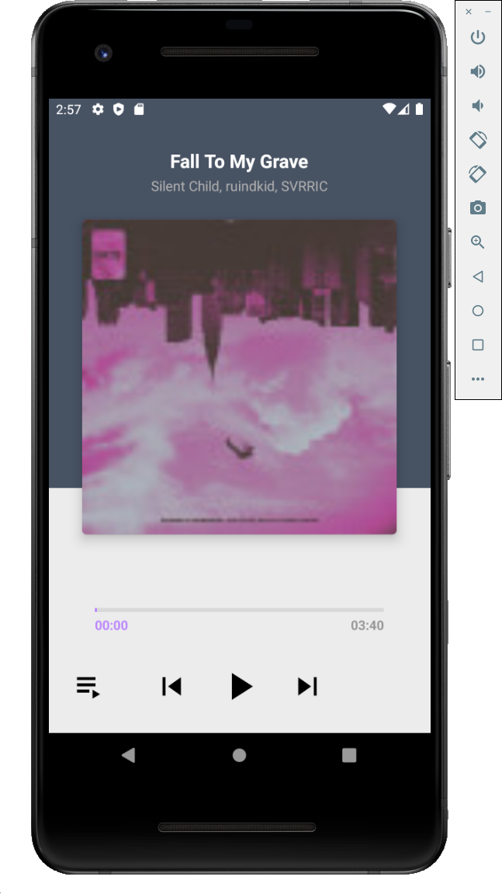

# aop-part4-chapter02 - 음악 스트리밍 앱

# 목차

1. 인트로 (완성앱 & 구현 기능 소개)
2. 재생화면 UI 구성하기
3. 플레이리스트 UI 구성하기
4. 음악 목록 API 만들기
5. ExoPlayer를 이용하여 음악 재생하기 (1)
6. ExoPlayer를 이용하여 음악 재생하기 (2)
7. ExoPlayer를 이용하여 음악 재생하기 (3)
8. ExoPlayer를 이용하여 음악 재생하기 (4)
9. 아웃트로

# 결과화면

# 이 챕터를 통해 배우는 것

- **Exoplayer** 사용하기 (2)
  - custom controller
  - Playlist 등
- androidx.constraintlayout.widget.Group
- **Seekbar** Custom 하기

### ExoPlayer

- Google이 Android SDK 와 별도로 배포되는 오픈소스 프로젝트
- 오디오 및 동영상 재생 가능
- 오디오 및 동영상 재생 관련 강력한 기능들 포함
- 유튜브 앱에서 사용하는 라이브러리
- https://exoplayer.dev/hello-world.html

---

### 음악 스트리밍 앱

Retrofit 을 이용하여 재생 목록을 받아와 구성함

재생 목록을 클릭하여 ExoPlayer 를 이용하여 음악을 재생할 수 있음.

이전, 다음 트랙 버튼을 눌러서 이전, 다음 음악으로 재생하고, ui 를 업데이트 할 수 있음.

PlayList 화면과 Player 화면 간의 전환을 할 수 있음.

Seekbar 를 custom 하여 원하는 UI 로 표시할 수 있음.

